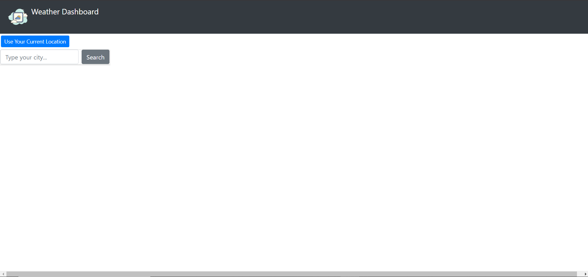
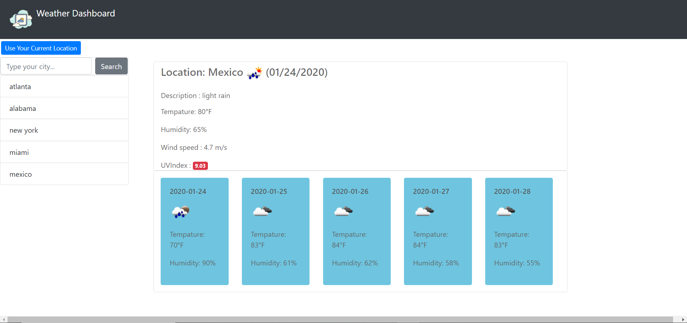

# Weather-Dashboard

 I build a weather dashboard application with search functionality to find current weather conditions and the future weather outlook for multiple cities.
 And also this application has access to your current location if you allow the browser to use your current location,and gave your current location weather information.

 ##List of API's use in this application 
 *[OpenWeather API](https://openweathermap.org/api)
 
 *[Geolocation API](https://developer.mozilla.org/en-US/docs/Web/API/Geolocation_API)

 *[Momentsjs API](https://momentjs.com/)

 ## Picture of application
  

  

 

 